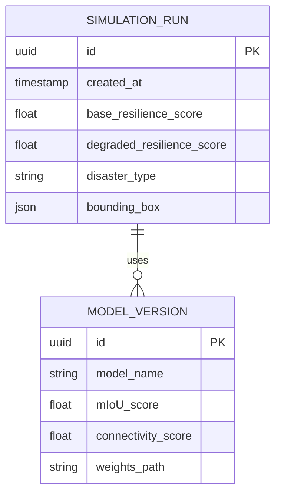

# Database Design

**Project**: ATLAS — Route Resilience
**Status**: APPROVED

---

## 1. Storage Strategy
Due to the constraints of the hackathon and the requirement for zero-latency interactive visualizations, we will utilize a hybrid storage strategy:

- **Graph Data (Hot Storage)**: The topological graph (nodes, edges, centrality weights) will be serialized into highly optimized `GeoJSON` files. These files will be loaded into the Backend's memory (RAM) at startup for instant $O(1)$ disruption intersection calculations.
- **Metadata & Simulation Logs (Cold Storage)**: An SQLite database will store simulation runs, resilience scores, and model versions to prove traceability.

*(Note: We rejected heavy graph databases like Neo4j because installing and querying them live adds unnecessary latency and deployment complexity for a 5-minute hackathon demo).*

## 2. ER Diagram

## 3. Storage Structures

### Graph Storage (GeoJSON Schema)
The pre-computed "Hero City" graph is stored as a `FeatureCollection`.
- **Nodes (Point Features)**:
  - `properties`: `node_id`, `degree`, `betweenness_centrality`, `k_core`, `lat`, `lon`.
- **Edges (LineString Features)**:
  - `properties`: `edge_id`, `source`, `target`, `length_meters`, `confidence_score`.

### Simulation Storage (SQLite)
Table `simulations`:
- Tracks every bounding box drawn by a judge.
- Calculates the `delta` in Giant Component size.
- Useful for generating a "Report" at the end of the demo showing the most vulnerable areas discovered during the session.
