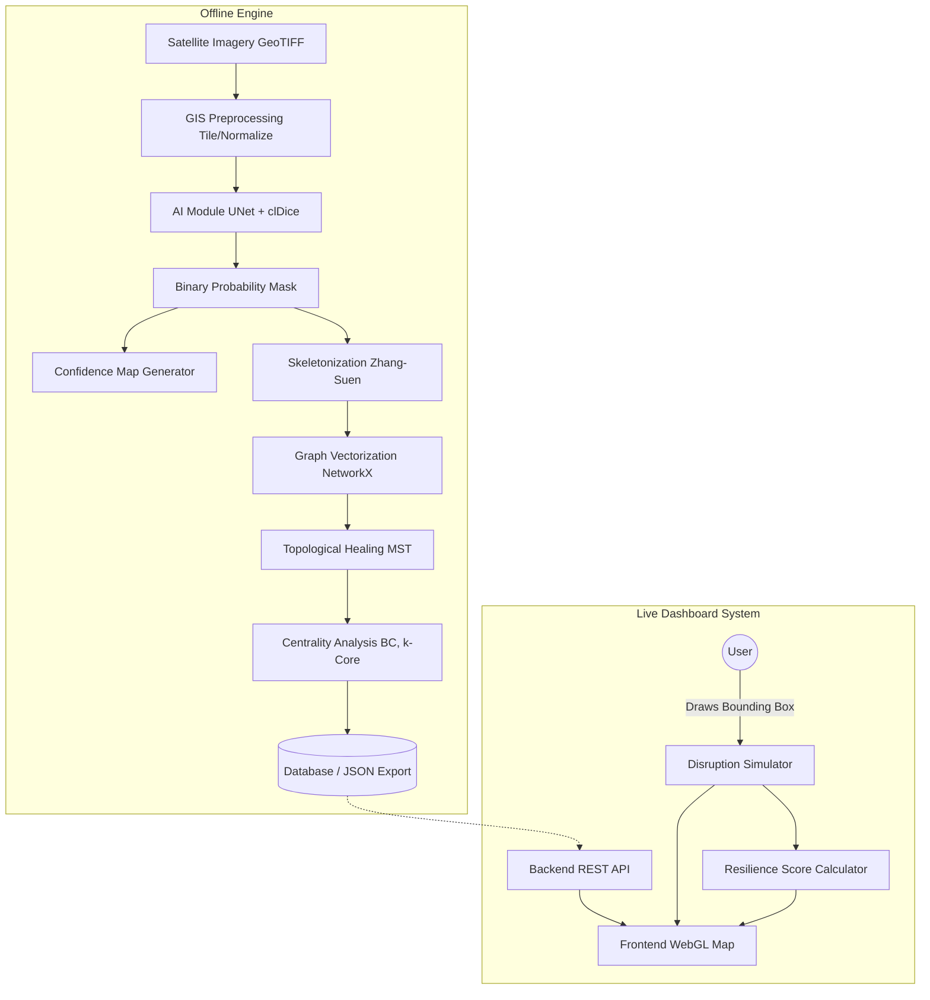

# High-Level Architecture (HLD)

**Project**: ATLAS — Route Resilience
**Status**: APPROVED

---

## 1. System Overview
ATLAS is designed as a decoupled, microservice-ready pipeline. To meet hackathon constraints, it operates in two distinct modes:
1. **Offline Processing Engine**: Runs the heavy AI and Graph $O(VE)$ mathematics to pre-compute the "Hero City" (Bengaluru) data.
2. **Live Interactive Dashboard**: Serves the pre-computed data and performs lightweight $O(E)$ geometric disruption simulations instantly on the frontend.

## 2. End-to-End Pipeline Diagram

## 3. Data Flow Specification

### Step 1: Ingestion & AI Extraction
1. **Input**: A high-resolution Optical Satellite GeoTIFF (RGB).
2. **Preprocessing**: The GIS module slices the image into $512 \times 512$ tiles, normalizes pixel values, and converts to tensor format.
3. **Inference**: The AI Model predicts a pixel-level probability mask of roads. It also outputs a Confidence Map (softmax entropy) identifying areas where occlusions (clouds) caused model uncertainty.

### Step 2: Graph Reconstruction & Healing
1. **Skeletonization**: The mask is thinned to 1-pixel wide centerlines.
2. **Vectorization**: Pixel paths are converted to a mathematical Graph $G(V,E)$ using NetworkX.
3. **Healing**: The Graph Module detects disjointed endpoints (degree 1) that are geographically close (e.g., $<30m$). It calculates a Minimum Spanning Tree (MST) across these endpoints and adds candidate edges to heal the network, ensuring a continuous Giant Component.

### Step 3: Centrality Analysis
1. **Analysis**: The system computes Betweenness Centrality (identifying bottlenecks), Closeness Centrality, and k-Core values for all nodes.
2. **Serialization**: The heavily annotated graph is serialized into an optimized GeoJSON format and saved to the database.

### Step 4: Interactive Disruption (Live)
1. **Serving**: The backend API serves the pre-computed GeoJSON to the frontend.
2. **Simulation**: The user draws a disaster bounding box on the UI.
3. **Calculation**: The frontend (or a fast backend endpoint) drops all edges intersecting the box, recalculates the Giant Component Size, and visually updates the heatmap and Resilience Score instantly.
