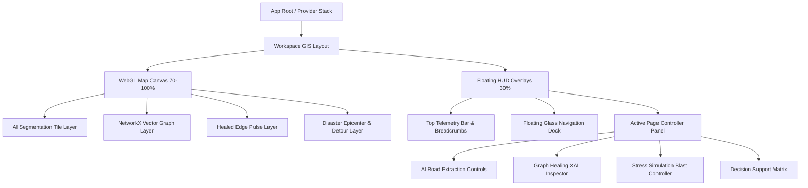

# Deliverable 1: UI Architecture Document

**Project:** ATLAS — Route Resilience (ISRO Bharatiya Antariksh Hackathon 2026 PS-4)  
**Target Platform:** Web (Desktop-first GIS Decision Support System)  
**Framework Architecture:** React 18 / TypeScript / Vite / Tailwind CSS / Framer Motion / Deck.gl & Mapbox GL JS  

---

## 1. Architectural Philosophy & Vision

The ATLAS frontend is engineered as a **mission-critical geospatial command and control interface**. It departs entirely from traditional web enterprise administration consoles (CRUD layouts) to emulate high-performance desktop software such as **ArcGIS Professional**, **Linear.app**, **Tesla Telemetry Software**, and **Apple Human Interface Guidelines (HIG)**.

### Core Architectural Rules:
1. **The Map is the Product (70/30 Spatial Rule):** The geospatial canvas continuously occupies ~70% to 100% of the viewport background. Control UI, statistics, and inspectors exist as floating, glassmorphic overlays (30% footprint) that never obscure the spatial reality.
2. **Deterministic State Synchronization:** All visual layers (AI segmentation probability masks, skeletonized polylines, network graphs, and disaster blast radiuses) derive directly from the centralized FastAPI backend state (`/api/v1/`).
3. **Zero-Latency Visual Feedback:** Every user interaction (hovering over a healed edge, tweaking AI confidence thresholds, clicking a disaster blast epicenter) reflects immediately via optimistic UI updates and GPU-accelerated WebGL rendering before backend recalculation completes.

---

## 2. Structural Layering & Z-Index Stack

To maintain visual clarity while rendering dense multi-layer geospatial data, the UI is organized into strict compositing layers:

```text
[Z-Index 1000] System Modals & Global Notifications (Command Palette / Export Dialog / Disaster Toast)
[Z-Index 500]  Floating Inspector Panels (Explainability XAI Viewer / Critical Road Inspector / Decision Support)
[Z-Index 400]  Persistent Navigation Overlays (Collapsed Dock / HUD Top Bar / Simulation Timeline HUD)
[Z-Index 300]  Interactive Map HUD Elements (Scale bar / Layer Switcher / Zoom Controls / Legend HUD)
[Z-Index 200]  WebGL Spatial Data Layers (Deck.gl / Mapbox Polylines / Heatmaps / Healed Edge Pulses)
[Z-Index 100]  Base Map Tiles (CartoDB Dark Matter / Mapbox Satellite Dark / ISRO Bhuvan WMTS)
```

---

## 3. Frontend Technology Stack & Component Hierarchy

### Core State & Routing:
* **State Management:** `Zustand` for lightweight, predictable global HUD and spatial selection state (selected road segment, active disaster filter, AI opacity slider).
* **Server Data Sync:** `TanStack Query (React Query v5)` for caching, background polling, and automatic invalidation of GeoJSON graph payloads.
* **Geospatial Engine:** `Mapbox GL JS v3` wrapped with `Deck.gl v9` for rendering 100,000+ vector edges at 60 FPS.

### Component Layer Breakdown:


---

## 4. Performance & Hardware Acceleration Strategy

Given the computational load of rendering massive vector polylines alongside animated glassmorphic UI panels:
* **GPU Offloading:** All map overlays use WebGL instance buffers. Animations on floating panels strictly animate `transform` and `opacity` to avoid CSS layout reflows.
* **Debounced Controls:** Sliders for RDP simplification ($\epsilon$) and search radius ($R$) debounce network fetches by 150ms while instantly adjusting local visual preview overlays.
* **Memory Management:** GeoJSON features are indexed using `Supercluster` and spatial R-trees (`rbush`) to ensure instantaneous point-in-polygon querying when inspecting road segments.
