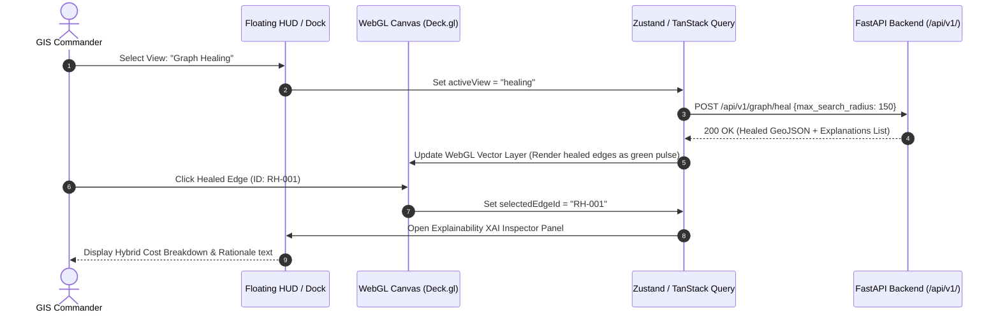
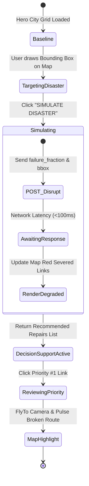

# Deliverable 7: ATLAS Interaction & Workflow Specification

This document maps user interactions to frontend state transitions, TanStack Query cache mutations, and FastAPI network requests.

---

## 1. Primary Operational Workflow Flowchart

---

## 2. Disaster Simulation & Decision Support Loop

---

## 3. Debounced Parameter Slider Behavior

When a user drags a parameter slider (e.g., RDP Simplification Tolerance $\epsilon$ from 2.0m to 5.0m):
1. **Immediate Visual Feedback (0ms):** The local numerical counter updates instantly using `Roboto Mono` tabular figures.
2. **Debounce Timer (150ms):** Prevents spamming the REST API while the mouse button is actively dragged.
3. **Optimistic Map Fade (150ms):** Existing map polyline opacity drops to 0.5 to signal incoming spatial data recalculation.
4. **Network Commit:** `POST /api/v1/graph/construct` is dispatched. Upon response, the WebGL buffer swaps atomically with zero flicker.
