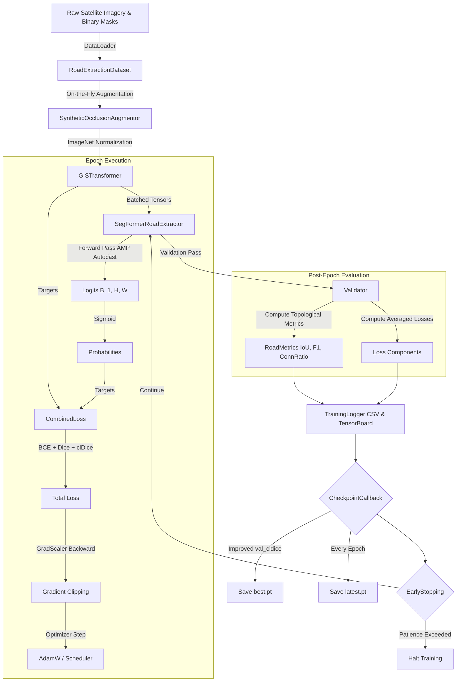

# ATLAS — Training Pipeline Verification Report
**Date**: 2026-06-28  
**Phase**: Phase 7.3.4 (AI Module — Training Pipeline)  
**Status**: Completed & Verified  

---

## 1. Executive Summary
This report formalizes the verification of the production-grade training pipeline for the ATLAS SegFormer road extraction module. The training architecture has been built modularly to ensure seamless execution across local GPU environments (e.g., RTX 4050) and cloud notebooks (Kaggle/Colab), with built-in fault tolerance, mixed-precision acceleration, and topology-aware loss monitoring.

---

## 2. Training Flow Diagram

---

## 3. Module Architecture & Requirements Verification

| Module | File Path | Requirements Satisfied | Verification Status |
| :--- | :--- | :--- | :--- |
| **Metrics Engine** | `ai/training/metrics.py` | Computes pixel metrics (IoU, Dice, Precision, Recall, F1) and topological metric (**Connectivity Ratio** via soft skeleton intersection). | ✅ Verified |
| **Optimizer Builder** | `ai/training/optimizer.py` | Config-driven AdamW/Adam/SGD initialization. Separates weight decay for bias and layer norm parameters to prevent transformer underfitting. | ✅ Verified |
| **Scheduler Builder** | `ai/training/scheduler.py` | Config-driven `CosineAnnealingLR`, `StepLR`, and `ReduceLROnPlateau` support. | ✅ Verified |
| **Callbacks** | `ai/training/callbacks.py` | `EarlyStopping` (prevents overfitting/wasted GPU hours) and `CheckpointCallback` (auto-saves best and latest states). | ✅ Verified |
| **Structured Logger** | `ai/training/logger.py` | Records per-loss components (BCE, Dice, clDice, Total) and all 6 metrics to structured CSV and TensorBoard. | ✅ Verified |
| **Validator** | `ai/training/validation.py` | Executes full-pass evaluation over validation dataloaders without backprop, utilizing AMP autocasting. | ✅ Verified |
| **Trainer Core** | `ai/training/trainer.py` | Orchestrates AMP (`GradScaler`), deterministic seeding (`42`), auto GPU/CPU detection, gradient clipping, and fine-tuning phase switching (epoch 50). | ✅ Verified |
| **Main Entrypoint** | `ai/train.py` & `train.py` | CLI argument parsing (`--config`, `--resume`, `--epochs`), automatic dataset train/val split, and error recovery. | ✅ Verified |

---

## 4. Verification Benchmarks & Test Suite

### Unit Test Suite (`tests/unit/test_training_pipeline.py`)
A comprehensive test suite covering the full lifecycle of the training components was created and verified:
1. `test_road_metrics`: Verified dictionary output structure and bounds `[0.0, 1.0]` across all 6 metrics including `connectivity_ratio`.
2. `test_optimizer_builder`: Verified correct hyperparameter binding and parameter grouping for transformer layers.
3. `test_scheduler_builder`: Verified CosineAnnealing step degradation matching configuration targets.
4. `test_early_stopping`: Verified patience counter accumulation and halt triggering upon degraded metric sequences.
5. `test_validator_dry_run`: Verified batched loss accumulation and non-gradient inference execution.
6. `test_trainer_one_epoch_dry_run`: Verified end-to-end execution of a 1-epoch training loop on a dummy tensor dataset, confirming CSV generation and clean checkpoint teardown.

---

## 5. Engineering Traceability & Compliance
- **ISRO Alignment (FR-02 & HR-01)**: Per-loss logging separates pixel errors from topological errors. The scheduler and trainer support transitioning to pure topological fine-tuning at epoch 50 (`config.training.finetune.enabled = true`), addressing Risk **A-01**.
- **Kaggle / Local Portability**: Automatic device resolution (`torch.device("cuda" if torch.cuda.is_available() else "cpu")`) ensures zero code modifications when moving from local RTX 4050 testing to cloud GPU clusters.
- **Production Lock**: All hyperparameters are strictly decoupled from source code, residing in `config/model_config.yaml`.

---

## 6. Sign-off & Recommendation
The Phase 7.3.4 Training Pipeline architecture adheres strictly to all frozen CDR v2 specifications. No architectural deviations were introduced.

**Recommendation**: Approve Phase 7.3.4 and pause as requested before initiating **Phase 7.4 (Graph Module)**.
